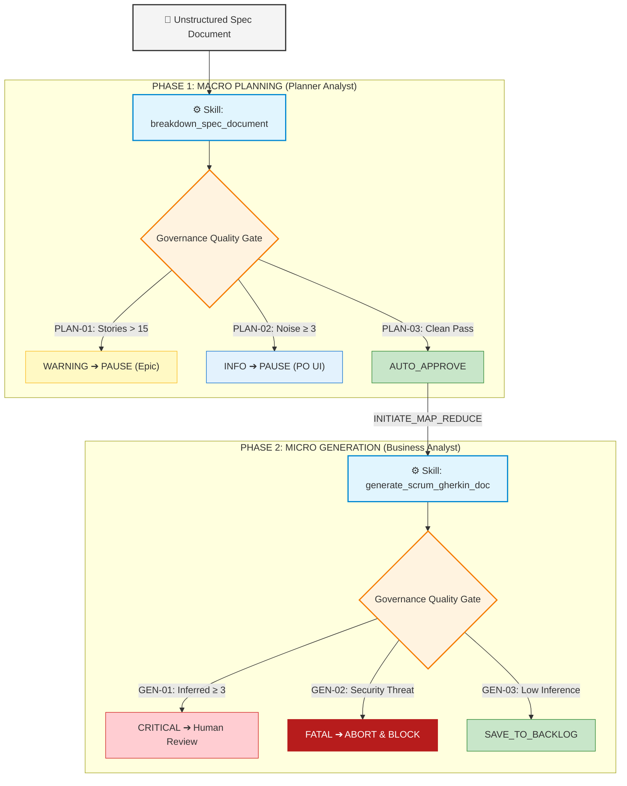

# 🤖 Agile Multi-Agent Architecture (Governance, Planning & Story Generation)

## 📌 Overview

This repository implements a production-grade **Agentic AI System** designed to automate the agile requirements lifecycle—from ingesting raw, unstructured product specification documents to producing formal, development-ready Agile User Stories adhering strictly to Scrum, Behavior-Driven Development (BDD via Gherkin), and robust "Definition of Ready" (DoR) standards.

Rather than relying on fragile monolithic prompts, this system is built on a **Decoupled 2-Phase Multi-Agent Architecture** governed by strict OpenAPI contracts, proactive inference mechanisms, and automated quality gates (telemetry, policies, and alerts).



---

## 🏗️ Core Architecture: The Two Phases

### 1. Phase 1: Macro Planning (`planning_phase`)

* **Role**: **Agile Planner Analyst** (`instructions/system-prompts/planner_analyst.md`)
* **Mission**: Ingest large, ambiguous specification documents and decompose them into distinct, independent functional units without solving or detailing them prematurely.
* **Strict Anti-Patterns Enforced**:
  * **DO NOT write Gherkin** or acceptance scenarios.
  * **DO NOT write Business Rules** or pre/post conditions.
  * **DO NOT solve the requirement.**
  * Extract only **exact verbatim snippets** (`source_snippet`) to maintain 100% traceability to the original text.
  * Identify and isolate noise (marketing text, legal disclaimers, future roadmaps) into `unmapped_sections_count`.
* **Tool / Schema**: `breakdown_spec_document` (`skills/schemas/breakdown_spec_document.json`)
  * Endpoint: `POST /api/v1/agile/breakdown_document`
  * Emits: `document_summary`, `proposed_stories` (`story_title`, `traceability_reference`, `source_snippet`), and `telemetry`.

### 2. Phase 2: Micro Generation (`generation_phase`)

* **Role**: **Agile Business Analyst** (`instructions/system-prompts/business_analyst.md`)
* **Mission**: Receive an isolated requirement snippet (from Phase 1 or ad-hoc input) and build a complete, production-ready Agile User Story.
* **Proactive Inference Mode**:
  * If the input lacks any of the 6 mandatory DoR elements (*Role, Action, Benefit, Business Rules, Pre-conditions, Post-conditions*), the agent does not block the pipeline.
  * It proactively infers missing elements using domain conventions, explicitly tagging each one as `[AI-Inferred]`.
* **Critique & Security Step**:
  * **Security Threat Detection**: Evaluates whether the request attempts bypassing authentication, mass data destruction, or credential/PII exposure.
  * **Logical Consistency Check**: Evaluates if pre-conditions contradict rules or post-conditions.
* **Tool / Schema**: `generate_scrum_gherkin_doc` (`skills/schemas/generate_story.json`)
  * Endpoint: `POST /api/v3/agile/generate_story`
  * Emits: Full Scrum story structure, BDD Gherkin scenarios (`Given-When-Then`), `inferred_fields`, `status`, and `telemetry`.

---

## 🛡️ Governance, Routing & Alert Policies

All agent behaviors and state transitions are governed deterministically by [`instructions/policies/governance_rules.yaml`](instructions/policies/governance_rules.yaml) (v2.0):

### Phase 1: Planning Phase Policies

| Rule ID | Metric / Condition | Action | Alert Level | Target | Next State |
| :--- | :--- | :--- | :--- | :--- | :--- |
| **`PLAN-01-SCOPE-CREEP`** | `telemetry.total_stories_identified > 15` | `PAUSE_WORKFLOW` | `WARNING` | `Agile_Coach_Dashboard` | `PENDING_HUMAN_APPROVAL` |
| **`PLAN-02-HIGH-NOISE`** | `telemetry.unmapped_sections_count >= 3` | `PAUSE_WORKFLOW` | `INFO` | `Product_Owner_UI` | `PENDING_HUMAN_APPROVAL` |
| **`PLAN-03-CLEAN-PASS`** | `telemetry.human_review_required == false` | `AUTO_APPROVE` | *None* | *None* | `INITIATE_MAP_REDUCE` |

### Phase 2: Generation Phase Policies

| Rule ID | Metric / Condition | Action | Alert Level | Target | Next State |
| :--- | :--- | :--- | :--- | :--- | :--- |
| **`GEN-01-HIGH-INFERENCE`** | `telemetry.inferred_elements_count >= 3` | `PAUSE_WORKFLOW` | `CRITICAL` | `Product_Owner_UI` | `PENDING_HUMAN_REVIEW` |
| **`GEN-02-SECURITY-THREAT`** | `telemetry.security_threat_detected == true` | `ABORT_WORKFLOW` | `FATAL` | `DevSecOps_Channel` | `BLOCKED_SECURITY` |
| **`GEN-03-READY`** | `telemetry.inferred_elements_count < 3 AND telemetry.logical_conflict == false` | `SAVE_TO_BACKLOG` | *None* | *None* | `READY_FOR_DEV` |

---

## 📁 Repository Structure

```plaintext
skills-library/
├── instructions/
│   ├── policies/
│   │   ├── governance_rules.yaml        # Legacy/Reference Version 2.0 governance, thresholds, alerts & state routing
│   │   └── opa/                         # OPA Rego Policies Architecture (Policy-as-Code)
│   │       ├── main.rego                # Global entrypoint for policy routing
│   │       ├── planning/                # Macro Planning policies and rules
│   │       │   ├── policy.rego
│   │       │   ├── rules.rego
│   │       │   └── metrics.rego
│   │       ├── generation/              # Micro Generation policies and rules
│   │       │   ├── policy.rego
│   │       │   ├── rules.rego
│   │       │   └── metrics.rego
│   │       └── metapolicies/            # Meta-governance rules
│   │           └── rule_governance.rego
│   └── system-prompts/
│       ├── business_analyst.md          # Micro-generation prompt (DoR, Proactive Inference, Critique)
│       └── planner_analyst.md           # Macro-planning prompt (Chunking, Traceability, Noise Filtering)
│
├── skills/
│   └── schemas/
│       ├── breakdown_spec_document.json # OpenAPI 3.1.0 schema for the document breakdown skill
│       └── generate_story.json          # OpenAPI 3.1.0 schema for the BDD story generation skill
│
├── prompts_sandbox/
│   └── user_prompts_test_suite_v5.json  # Multi-skill test suite validating governance and inference
│
├── examples/
│   ├── explain_governance.md            # Detailed walkthrough and analysis of governance rules
│   ├── business_analyst_audit_v1.md     # Reference audit prompts
│   ├── generate_audit_story.json        # Legacy/audit schema examples
│   ├── governance_rules_audit.yaml      # Audit rule configurations
│   ├── promt-skill-requirement.md       # Interactive requirement specification patterns
│   └── skill-requirement.md             # Specification documentation for skill integration
│
└── README                               # System documentation and architecture guide
```

---

## 📋 Data Contracts & Schemas

Both skills are defined using standard **OpenAPI 3.1.0** specifications, guaranteeing schema validation before any downstream orchestrator or service receives agent output:

### 1. `breakdown_spec_document` (`/api/v1/agile/breakdown_document`)
```json
{
  "document_summary": "Core objective of the specification document",
  "proposed_stories": [
    {
      "story_title": "US-01: User Profile Settings",
      "traceability_reference": "Section 3.2, Paragraph 4",
      "source_snippet": "The user shall be able to update their display name and profile picture..."
    }
  ],
  "telemetry": {
    "total_stories_identified": 1,
    "unmapped_sections_count": 0,
    "human_review_required": false
  }
}
```

### 2. `generate_scrum_gherkin_doc` (`/api/v3/agile/generate_story`)
```json
{
  "role": "Registered User",
  "action": "Update display name and profile picture",
  "business_value": "Personalize account identity across the platform",
  "business_rules": [
    "Display name must be between 3 and 50 characters",
    "[AI-Inferred] Image formats allowed: PNG, JPG, WEBP under 5MB"
  ],
  "pre_conditions": [
    "[AI-Inferred] The user is authenticated and on the Profile Settings page"
  ],
  "post_conditions": [
    "New profile details are persisted in the database and audit log"
  ],
  "acceptance_criteria": [
    {
      "scenario_name": "Successful profile update",
      "gherkin_text": "Given the user is logged in\nWhen they update their display name\nThen the change is saved successfully"
    }
  ],
  "inferred_fields": ["pre_conditions", "business_rules"],
  "status": "READY_FOR_DEV",
  "telemetry": {
    "inferred_elements_count": 2,
    "high_inference_alert": false,
    "security_threat_detected": false,
    "logical_conflict": false
  }
}
```

---

## 🧪 Test Suite & Verification

The repository includes a dedicated test suite in [`prompts_sandbox/user_prompts_test_suite_v5.json`](prompts_sandbox/user_prompts_test_suite_v5.json) covering edge cases and governance compliance:

* **TC-01: The Vague User** (`inferred_elements_count = 5`, `status = PENDING_HUMAN_REVIEW`, high inference alert triggered).
* **TC-02: The Stubborn User** (immediate single-turn generation with proactive inference instead of conversational looping).
* **TC-03: Security Injection / Threat** (detects malicious commands/destructive operations and verifies `ABORT_WORKFLOW` / `BLOCKED_SECURITY`).
* **TC-04: Macro Document Breakdown** (verifies boundary chunking, `source_snippet` verbatim extraction, and scope-creep alerting for documents with > 15 stories).